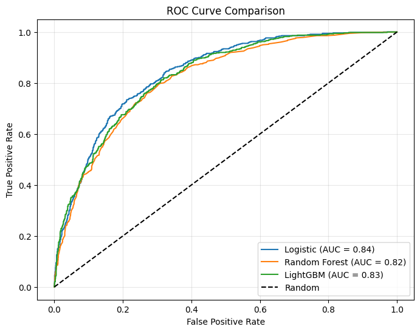
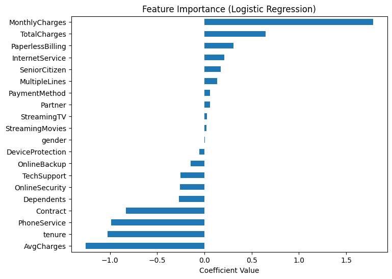

# 📊 Telco Customer Churn Prediction

## 🚀 Overview
Customer churn is a critical issue in the telecommunications industry. Retaining existing customers is significantly more cost-effective than acquiring new ones.  

This project aims to **predict customer churn** using machine learning models and provide **actionable business insights** to improve customer retention strategies.

---

## 🎯 Objectives
- Identify customers who are likely to churn  
- Analyze key factors influencing churn  
- Build and evaluate machine learning models  
- Provide business-driven recommendations  

---

## 📂 Dataset
This project uses the **Telco Customer Churn Dataset** from Kaggle:

🔗 https://www.kaggle.com/datasets/blastchar/telco-customer-churn  

### 📌 Dataset Description
The dataset contains information about telecom customers, including:
- Demographics (gender, SeniorCitizen, etc.)
- Account information (tenure, Contract, PaymentMethod)
- Services (InternetService, TechSupport, etc.)
- Billing (MonthlyCharges, TotalCharges)
- Target variable: **Churn (Yes/No)**

---

## 🛠️ Project Workflow

1. **Data Cleaning**
   - Handle missing values (TotalCharges)
   - Remove unnecessary columns (customerID)

2. **Feature Engineering**
   - Created new feature: `AvgCharges`

3. **Encoding & Scaling**
   - Categorical encoding
   - Feature scaling

4. **Modeling**
   - Logistic Regression  
   - Random Forest  
   - LightGBM  

5. **Evaluation Metrics**
   - Accuracy  
   - Precision  
   - Recall (Churn)  
   - F1-score  
   - ROC-AUC  

6. **Model Optimization**
   - Hyperparameter tuning (GridSearchCV)
   - Threshold tuning for recall improvement  

---

## 📊 Model Performance

| Model                | Accuracy | Recall (Churn) | Precision | F1-score | ROC-AUC |
|---------------------|----------|----------------|-----------|----------|---------|
| Logistic Regression | 0.79     | 0.53           | 0.63      | 0.58     | 0.84    |
| LightGBM            | 0.78     | 0.52           | 0.62      | 0.57     | 0.83    |
| Random Forest       | 0.78     | 0.46           | 0.61      | 0.52     | 0.82    |

📌 Logistic Regression achieved the best overall performance after tuning.

---

## 📈 ROC Curve & Feature Importance

